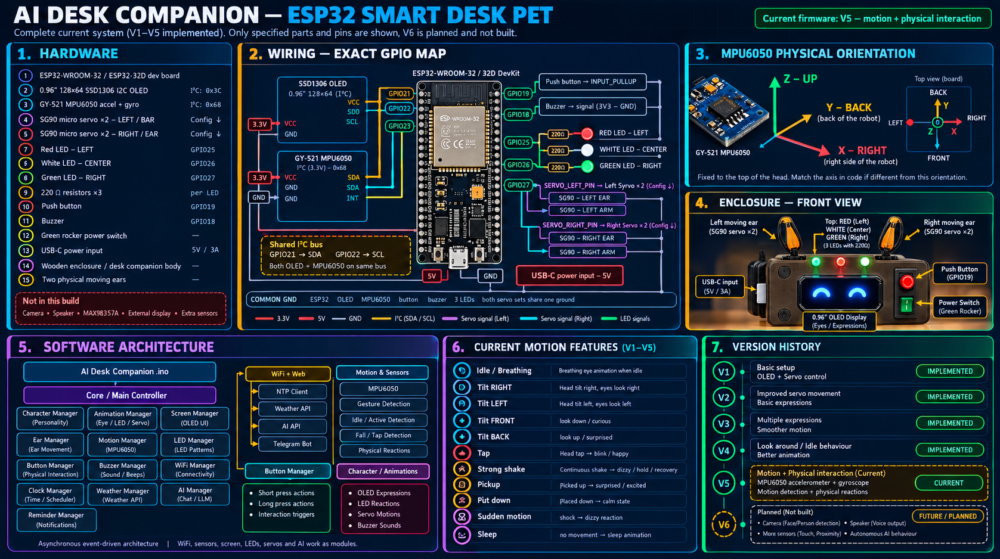

# 🤖 AI Desk Companion

> A small interactive desk companion built around an ESP32, a 128×64 OLED face, three expressive LEDs, two servo ears, a buzzer, a push button, and a GY-521 MPU6050 motion sensor.
>
> **Firmware version represented by this repository: V5**

<p align="center">
  
</p>

---

## 📌 What is this project?

AI Desk Companion is a physical desktop character designed to behave like a small living desk pet rather than a conventional sensor/display project.

The ESP32 controls:

- 👀 A 0.96-inch 128×64 SSD1306 OLED used as the character's face
- 💡 Three top LEDs for directional and emotional feedback
- 🐰 Two SG90 servo motors acting as physical ears
- 🔊 An active buzzer for notification and reaction sounds
- 🔘 One push button for screen navigation and modes
- 🫨 A GY-521 MPU6050 for accelerometer + gyroscope interaction
- 📶 Wi-Fi for live clock, weather, and AI message retrieval

The firmware is intentionally modular. Character drawing, animation, buttons, LEDs, ears, motion sensing, Wi-Fi, clock, weather, AI messages, reminders, and screens are separated into managers so that one feature can be changed without rewriting the whole application.

---

# ✨ Current Features

## OLED character

The character is rendered procedurally using Adafruit GFX primitives. It does **not** depend on a large bitmap frame buffer.

The expression vocabulary includes:

- Normal
- Blink
- Look left / right / up / down
- Bored
- Playful
- Sleepy / Sleep
- Excited
- Thinking
- Wink
- Surprised / Shock
- Confused
- Suspicious
- Worried / Scared
- Relieved
- Laughing
- Rolling eyes
- Happy / Sad / Angry
- Shy
- Curious
- Happy squint
- Tiny excited
- Side-eye
- Smug
- Mischievous
- Annoyed
- Dizzy
- Fake sleep
- Attention
- Wake
- Yawn
- Stretch
- Firework
- Glee
- Focused
- Skeptic
- Frustrated
- Unimpressed
- Squint
- Furious
- Awe

Many apparent animations are sequences of these base expressions. For example, a double blink is implemented as a sequence instead of requiring another expression enum value.

## 🐰 Servo ears

Two SG90 servos provide physical body language.

Ear behaviour is driven from the same expression system used by the OLED. The ears can also perform dedicated motion reactions such as:

- Perk-up
- Droop
- Happy wiggle
- Excited wiggle
- Dizzy flutter
- Yawn droop
- Pickup reaction
- Landing reaction
- Shock reaction
- Tilt left/right/front/back
- Tap reaction
- Worried reaction

The ear layer is optional. If the servos are disconnected or ear mode is disabled, the OLED and other systems continue to operate.

## 💡 Three reactive LEDs

The three LEDs are treated as an additional physical expression layer:

| Position | GPIO | Typical role |
|---|---:|---|
| 🔴 Left | GPIO25 | Left-side / directional reactions |
| ⚪ Center | GPIO26 | Attention / center reaction |
| 🟢 Right | GPIO27 | Right-side / directional reactions |

The LED manager supports ambient states and short choreographies such as:

- Left → center → right sweep
- All flash
- Wake animation
- Notification flash
- Motion shock
- Motion shake
- Breathing
- Directional holds
- Smooth fade behaviour

Each LED uses its own **220 Ω series resistor**.

## 🔊 Buzzer

The project uses an active buzzer for simple non-blocking sound patterns.

It is used for:

- Boot sound
- Button feedback
- Lock / unlock confirmation
- Reminder notification
- Error feedback
- Success feedback
- Fun/special-event sounds
- Motion shock
- Motion dizzy

This is intentionally a buzzer-based sound system, not an audio playback system.

## 🔘 Button controls

The firmware uses one button with `INPUT_PULLUP`.

| Interaction | Function |
|---|---|
| Single press | Play attention reaction, then advance to next screen |
| Double press | Toggle LED Character Mode |
| Triple press | Toggle Ear Mode |
| Long press | Lock / unlock current screen |
| Quadruple press | Enter / exit Animation Display Mode |

The button implementation uses debouncing and a short click window so that a single click can be distinguished from double/triple/quadruple presses. (With Animation Display Mode enabled, a triple press is delivered one click-window later, so a 4th click can still be recognised.)

## 🎞️ Animation Display Mode

Plays animations from the animation-cloud system (website → Cloudflare Worker → GitHub → ESP32) on the OLED.
Implemented in `CloudAnimation.h / .cpp`; the Worker, website, storage and animation format are unchanged.

- **Enter / exit:** four quick presses. Entry is ignored while the screen is locked; exit always works.
- **While active:** the normal screens stop cycling and the player owns the OLED. WiFi, LEDs, ears, buzzer and motion keep running. Double press (LED mode) and triple press (ear mode) still work; single and long press do nothing.
- **Control:** choose play / slideshow / stop on the website; the device polls the same `/api/device/command` endpoint as the standalone client.
- **Setup:** run `npm run gen:firmware` in the `cloud/` folder; it writes `secrets.h` here (WiFi, API URL, device token, optional weather key). See `SETUP.md` at the project root.
- **Disable:** set `ENABLE_ANIMATION_MODE false` in `Config.h`.
- **Library note:** needs ArduinoJson **v7** (the player uses `JsonDocument`).

## ✎ Global Draw Pad

The Draw Pad supports both the existing local ESP32 page and a global cloud-relay path.

- The Animation Cloud **Draw Pad** button creates a short-lived Draw Pad session.
- The browser connects to the existing Cloudflare Worker over secure WebSocket.
- The ESP32 makes the outbound WebSocket connection, so the browser does not need to be on the same Wi-Fi network.
- Drawing commands are relayed live to the ESP32's 128×64 SSD1306.
- The existing local Draw Pad page remains available for same-network use.
- Closing the Draw Pad WebSocket releases OLED ownership immediately; a stale session is also released automatically.

### Additional Arduino library

Install **WebSockets** (`arduinoWebSockets`, Links2004) in Arduino IDE for the global relay client.

The existing `ESPAsyncWebServer` / `AsyncTCP` libraries are still required for the local Draw Pad.

## 🫨 MPU6050 motion interaction

The GY-521 MPU6050 is used through the existing I²C bus.

The firmware reads both:

- 3-axis acceleration
- 3-axis angular velocity from the gyroscope

The motion manager supports logic for:

- Gentle tap
- Strong impact / shock
- Strong shake
- Repeated shake escalation
- Sudden rotation
- Dizzy reaction
- Pickup detection
- Landing detection
- Front/back tilt
- Left/right tilt
- Excessive tilt / worried reaction
- Movement wake-up from sleep

The implementation intentionally uses filtering, hysteresis, multiple sensor conditions, and cooldowns instead of triggering a full reaction from every tiny movement.

---

# 🧠 System Architecture

```text
                              ┌──────────────────────┐
                              │      ESP32 MCU       │
                              │   Main Application   │
                              └──────────┬───────────┘
                                         │
              ┌──────────────────────────┼──────────────────────────┐
              │                          │                          │
              ▼                          ▼                          ▼
       CharacterManager           AnimationManager            ScreenManager
              │                          │                          │
              │                          │                ┌─────────┼──────────┐
              │                          │                │         │          │
              ▼                          ▼                ▼         ▼          ▼
          OLED Face                Expression       Clock      Weather      AI
                                         │
                     ┌───────────────────┼────────────────────┐
                     │                   │                    │
                     ▼                   ▼                    ▼
                 LEDManager         EarManager          BuzzerManager
                     │                   │
                     ▼                   ▼
                3 LEDs              2 SG90 Ears

Button ─────────────► ButtonManager ─────────────► Screen / Mode control

GY-521 MPU6050 ────► MotionManager
                         │
             ┌───────────┼─────────────┐
             ▼           ▼             ▼
        Animation      LEDs           Ears
             │
             ▼
           Buzzer

Wi-Fi ───────────────► WiFiManager
                         │
                 ┌───────┼────────┐
                 ▼       ▼        ▼
                NTP   Weather     AI API
```

### Design principle

The project follows a layered model:

1. **Hardware managers** communicate with physical devices.
2. **Character/Animation** decide what the character looks like.
3. **ScreenManager** decides what information is displayed.
4. **MotionManager** interprets physical movement and requests reactions.
5. LEDs, ears and buzzer mirror the character's state without owning the OLED state.
6. The main `.ino` coordinates all managers through `setup()` and `loop()`.

Most runtime animation is based on `millis()` rather than long blocking delays.

---

# 🧩 Hardware Components

| Component | Qty | Purpose |
|---|---:|---|
| ESP32-WROOM / ESP32-32D development board | 1 | Main controller + Wi-Fi |
| 0.96" 128×64 SSD1306 OLED | 1 | Character face and information screens |
| GY-521 MPU6050 | 1 | Accelerometer + gyroscope |
| SG90 9g servo | 2 | Physical ears |
| Red LED | 1 | Left indicator |
| White/clear LED | 1 | Center indicator |
| Green LED | 1 | Right indicator |
| 220 Ω resistor | 3 | LED current limiting |
| Push button | 1 | User input |
| Active buzzer | 1 | Sound effects |
| Rocker power switch | 1 | Main power control |
| USB-C connection | 1 | ESP32 power/programming |
| Wooden enclosure | 1 | Physical body |
| Jumper wires / hookup wire | as required | Internal wiring |

### Optional tools

- Soldering iron
- Solder
- Multimeter
- Small screwdriver
- Servo horn / linkage hardware
- Hot glue or suitable mechanical mounting hardware

---

# 📐 Complete Pinout

The current firmware defines the following pins in `Config.h`.

| ESP32 GPIO | Connected device | Direction / role |
|---:|---|---|
| GPIO18 | Active buzzer | Output |
| GPIO19 | Push button | Input, `INPUT_PULLUP` |
| GPIO21 | OLED SDA + MPU6050 SDA | I²C SDA |
| GPIO22 | OLED SCL + MPU6050 SCL | I²C SCL |
| GPIO23 | MPU6050 INT | Reserved input / interrupt line |
| GPIO25 | Red / left LED | Output |
| GPIO26 | White / center LED | Output |
| GPIO27 | Green / right LED | Output |
| GPIO32 | Left SG90 servo | Servo output |
| GPIO33 | Right SG90 servo | Servo output |

### I²C addresses

| Device | Address |
|---|---:|
| SSD1306 OLED | `0x3C` |
| MPU6050 | `0x68` |

The MPU6050 address is `0x68` because `AD0` is connected to GND.

If AD0 were HIGH, the MPU6050 would normally appear at `0x69`; this firmware is configured for `0x68`.

---

# 🔌 Wiring Guide

## 1. OLED — SSD1306 128×64

| OLED pin | ESP32 |
|---|---|
| VCC / VDD | 3.3V |
| GND | GND |
| SDA | GPIO21 |
| SCL | GPIO22 |

Configuration:

```cpp
#define OLED_SDA_PIN     21
#define OLED_SCL_PIN     22
#define OLED_I2C_ADDRESS 0x3C
#define SCREEN_WIDTH     128
#define SCREEN_HEIGHT    64
#define OLED_RESET_PIN   -1
```

The OLED and MPU6050 intentionally share GPIO21/GPIO22 because they are both I²C devices with different addresses.

---

## 2. MPU6050 / GY-521

| GY-521 pin | Connection |
|---|---|
| VCC | 3.3V |
| GND | GND |
| SDA | GPIO21 |
| SCL | GPIO22 |
| AD0 | GND |
| INT | GPIO23 |
| XDA | Not connected |
| XCL | Not connected |

### MPU orientation in this enclosure

The sensor is mounted with:

```text
                 BACK
                   ↑
                   │ Y
                   │
        LEFT  ─────┼─────► RIGHT / GREEN LED
                   │
                   │
                   Z ↑
                 UP
```

In the physical build:

- **X axis points toward the right side of the box / green LED**
- **Y axis points toward the back of the box**
- **Z axis points upward**

This orientation is important because the motion code interprets X/Y/Z according to the physical mounting direction.

### Why both accelerometer and gyroscope are used

The accelerometer provides information about:

- gravity direction
- tilt
- linear movement / impacts
- vertical movement

The gyroscope provides information about:

- rotational movement
- sudden rotation
- motion intensity
- distinguishing a pickup/rotation from a simple stationary tilt

The motion system combines both instead of treating every acceleration spike as a shake.

---

## 3. LEDs

Each LED must have its own resistor.

### Left / red

```text
GPIO25 ── 220Ω ──► LED anode (+)
LED cathode (-) ──► GND
```

### Center / white

```text
GPIO26 ── 220Ω ──► LED anode (+)
LED cathode (-) ──► GND
```

### Right / green

```text
GPIO27 ── 220Ω ──► LED anode (+)
LED cathode (-) ──► GND
```

Do not omit the current-limiting resistors.

---

## 4. Push button

The button uses the ESP32 internal pull-up resistor.

```text
GPIO19 ───── BUTTON ───── GND
```

No external pull-up resistor is required by the current firmware.

The code reads the button as active-low:

```cpp
pinMode(BUTTON_PIN, INPUT_PULLUP);
```

---

## 5. Active buzzer

```text
GPIO18 ───── Buzzer signal
GND    ───── Buzzer GND
```

The current `BuzzerManager` uses HIGH/LOW timing patterns. It is designed for an active buzzer and simple notification sounds.

---

## 6. Servo ears

### Left ear

```text
Signal → GPIO32
```

### Right ear

```text
Signal → GPIO33
```

The firmware configures the servo channels at 50 Hz through `ESP32Servo`.

### Important servo power note

The servo signal pins come from the ESP32, but the servos can create current spikes. Use a stable servo supply appropriate for your SG90s and **connect the servo supply GND to ESP32 GND**.

Do not feed an arbitrary external voltage into the ESP32 3.3V rail.

The project currently uses these configured pulse limits:

```cpp
#define EAR_SERVO_MIN_US 500
#define EAR_SERVO_MAX_US 2400
```

If a particular servo mechanically reaches its limit before the desired angle, reduce its configured angle range rather than forcing it against the mechanical stop.

---

# ⚡ Power

For development, the ESP32 can be powered/programmed through USB-C.

The board's 5V/VIN input should receive an appropriate 5V source when using a regulated 5V supply.

### Important

- Do **not** feed 5V directly into the 3.3V pin.
- Servo power should be stable enough to prevent ESP32 resets.
- All modules that communicate with the ESP32 must share a common ground.
- If the servos cause resets, test them with a separate suitable supply while keeping grounds common.

---

# 🏠 Physical Enclosure

The physical character is assembled inside a small wooden enclosure.

The current front-panel layout is approximately:

```text
┌─────────────────────────────────┐
│   🔴        ⚪        🟢         │
│                                 │
│              🔘                 │
│                                 │
│       ┌─────────────────┐       │
│       │                 │       │
│       │   OLED FACE     │       │
│       │    128 × 64     │       │
│       │                 │       │
│       └─────────────────┘       │
│                                 │
└─────────────────────────────────┘
```

Additional physical elements:

- Green rocker power switch on the right side
- USB-C connection on the side/front area depending on enclosure revision
- Two moving servo ears at the top
- MPU6050 mounted inside the enclosure according to the documented axis orientation

The OLED itself acts as the character's face.

---

# 🗂️ Repository Structure

```text
AIDeskCompanion/
│
├── AIDeskCompanion.ino
├── Config.h
│
├── Character.h
├── Character.cpp
│
├── Animation.h
├── Animation.cpp
│
├── Buttons.h
├── Buttons.cpp
│
├── Buzzer.h
├── Buzzer.cpp
│
├── LEDManager.h
├── LEDManager.cpp
│
├── EarManager.h
├── EarManager.cpp
│
├── MotionManager.h
├── MotionManager.cpp
│
├── ScreenManager.h
├── ScreenManager.cpp
│
├── WiFiManager.h
├── WiFiManager.cpp
│
├── ClockManager.h
├── ClockManager.cpp
│
├── Weather.h
├── Weather.cpp
│
├── AI.h
├── AI.cpp
│
├── Reminders.h
├── Reminders.cpp
│
├── assests/
│   └── architecture.png
│
└── README.md
```

> The repository currently uses the directory name `assests`. This spelling is intentionally preserved here so the image path matches the supplied project files. It can be renamed to `assets` later if desired, but the README image path must then be updated too.

---

# 🧱 Source File Responsibilities

## `AIDeskCompanion.ino`

The main application entry point.

It:

1. Includes the hardware/software managers.
2. Creates the global manager instances.
3. Starts I²C and the OLED.
4. Starts every manager.
5. Plays the boot animation.
6. Processes button events.
7. Updates background systems.
8. Updates animation and screen state.
9. Draws the current frame.

The runtime loop is intentionally organized so that managers can perform their own non-blocking work.

---

## `Config.h`

This is the main configuration file and the first file to inspect when adapting the project to another build.

It contains:

- OLED pins/address
- button pin
- buzzer pin
- Wi-Fi credentials
- weather API configuration
- AI API configuration
- NTP settings
- button timing
- LED pins
- servo pins
- servo calibration angles
- MPU6050 address/interrupt pin
- motion thresholds
- ear animation offsets
- Wi-Fi reconnect timing
- sleep timing
- firmware version

The code is deliberately designed so hardware pin numbers are not scattered throughout the project.

---

## `Character.h / Character.cpp`

Responsible only for the OLED character itself.

The face is procedural and uses Adafruit GFX primitives. The animation system can therefore change eye position, shape, expression and scale without storing a large bitmap sequence.

`Character` exposes:

- initialization
- update
- drawing
- expression selection
- expression state
- transient expression timing

---

## `Animation.h / Animation.cpp`

The personality and animation engine.

It provides:

- idle behaviour
- micro-behaviours
- sleep/wake state machine
- expression sequences
- animation priorities
- button reactions
- reminder reactions
- weather reactions
- AI reactions
- motion reactions
- special idle events

### Animation priority model

```text
WAKE_SLEEP       highest
INTERACTION
NOTIFICATION
SCREEN_REACTION
IDLE
MICRO            lowest
```

This prevents a low-priority idle animation from incorrectly overriding an important interaction.

---

## `Buttons.h / Buttons.cpp`

Handles the physical button.

The implementation includes:

- input pull-up
- debounce
- press/release detection
- long press detection
- single click resolution
- double click resolution
- triple click resolution

A click is intentionally delayed by the configured double-click window so the firmware can determine whether another click follows it.

---

## `Buzzer.h / Buzzer.cpp`

Contains the sound pattern engine.

Sound patterns are stored as timing sequences and advanced with `millis()`. The buzzer does not require the main application to wait for a sound to finish.

---

## `LEDManager.h / LEDManager.cpp`

Owns the three physical LEDs.

It has two conceptual layers:

1. **Ambient layer** — expression-dependent state such as hold/breathe/off.
2. **Override layer** — short choreographies such as shock, notification, wake, and mode changes.

This prevents a short flash from permanently destroying the expression's normal LED state.

---

## `EarManager.h / EarManager.cpp`

Owns both SG90 servos.

It has:

- ambient expression poses
- short override choreographies
- eased movement
- wake/sleep sequences
- motion-specific reactions
- per-ear calibration

The servo manager also avoids repeatedly writing the same rounded angle once the servo has settled.

---

## `MotionManager.h / MotionManager.cpp`

Owns the MPU6050 communication and physical interaction interpretation.

It:

1. Initializes the MPU6050 directly through I²C registers.
2. Reads the 14-byte accelerometer/temperature/gyroscope register block.
3. Converts raw values to acceleration and angular velocity.
4. Applies smoothing filters.
5. Maintains slow baselines.
6. Detects motion patterns.
7. Requests synchronized OLED/LED/ear/buzzer reactions.

The project does not require an MPU6050 Arduino library for the current implementation; the motion manager communicates with the sensor through the existing `Wire` I²C interface.

---

## `ScreenManager.h / ScreenManager.cpp`

Owns the information-screen slideshow and interaction modes.

Current screens:

1. Character Home
2. Clock
3. Weather
4. Temperature
5. Quote
6. Reminders
7. AI Message
8. System Status

Screen order and durations are defined by `SCREEN_TABLE`, making the slideshow easy to modify.

---

## `WiFiManager.h / WiFiManager.cpp`

Provides a small non-blocking Wi-Fi state machine.

In live mode it:

- starts station mode
- attempts connection
- times out an unsuccessful attempt
- retries periodically

Other modules ask it whether Wi-Fi is available instead of implementing their own connection logic.

---

## `ClockManager.h / ClockManager.cpp`

Provides the device clock.

In live mode it uses NTP through the ESP32 time facilities.

Current default timezone configuration is:

```text
UTC + 5:30
```

which corresponds to IST.

The displayed clock is maintained locally between synchronization attempts.

---

## `Weather.h / Weather.cpp`

Provides weather and temperature information.

In live mode it requests data from the configured OpenWeatherMap-style endpoint and parses the JSON response with ArduinoJson.

The firmware keeps the last valid weather values when a later request fails, so a network failure does not necessarily erase the last displayed weather data.

---

## `AI.h / AI.cpp`

Provides a periodic AI-generated daily message.

The current implementation is **not a Telegram chatbot**. It is a periodic one-way API request for a short upbeat message.

The configured live endpoint in the supplied code is an Anthropic Messages endpoint, and the request asks for one short daily message.

This distinction is important: the repository supplied here does **not** contain the Telegram AI reminder implementation described in earlier project planning.

---

## `Reminders.h / Reminders.cpp`

The current firmware contains a small local reminder list.

The structure supports up to:

```cpp
#define MAX_REMINDERS 8
```

Each reminder stores:

- used state
- hour
- minute
- short text
- whether it has fired today

The supplied code currently adds two example reminders in `begin()`:

- 17:30 — Meeting 5:30
- 20:00 — Stretch break

In demo mode, a synthetic reminder is triggered approximately 30 seconds after boot.

### Current limitation

The supplied repository does **not** currently contain Telegram bot code, natural-language reminder parsing, persistent recurring reminders, or Telegram chat ID management. Those were planned features, but they are not present in this V5 source tree.

---

# 🖥️ Screen System

The screen registry currently contains:

```cpp
CHARACTER_HOME
CLOCK
WEATHER
TEMPERATURE
QUOTE
REMINDERS
AI_MESSAGE
SYSTEM_STATUS
```

Each screen has a minimum and maximum duration. The actual duration is randomized inside that range.

This prevents the companion from switching screens at exactly the same interval every time.

### Example configuration

```cpp
static ScreenSlot SCREEN_TABLE[] = {
  { ScreenType::CHARACTER_HOME, 3000, 5000, true },
  { ScreenType::CLOCK,          4000, 6000, true },
  { ScreenType::WEATHER,        4000, 6000, true },
  { ScreenType::TEMPERATURE,    3000, 5000, true },
  { ScreenType::QUOTE,          5000, 7000, true },
  { ScreenType::REMINDERS,      5000, 8000, true },
  { ScreenType::AI_MESSAGE,     5000, 7000, true },
  { ScreenType::SYSTEM_STATUS,  3000, 5000, true },
};
```

To disable a screen, change its final value to `false`.

To reorder screens, reorder the table entries.

---

# 🎭 Character Modes

## Mode 1 — NORMAL

OLED character behaviour works normally.

The top LEDs are not used as the active character layer.

## Mode 2 — LED CHARACTER

The three top LEDs synchronize with the character's expression.

### Toggle

**Double press** the button.

Entering the mode:

- OLED reacts
- buzzer plays a fun confirmation
- LEDs perform a left → center → right sweep
- LEDs finish with an all-flash

Leaving the mode:

- OLED performs a small reaction
- LEDs fade out
- normal OLED mode resumes

---

# 🐰 Ear Mode

Ear mode is independent of LED mode.

### Toggle

**Triple press** the button.

When enabled:

- ears perform a wake/perk animation
- ears settle into expression-driven poses

When disabled:

- both servos smoothly return to the configured `EAR_*_DOWN_ANGLE`
- the servos then stop changing position

The default configured rest/down angles are:

```cpp
EAR_LEFT_DOWN_ANGLE  = 10
EAR_RIGHT_DOWN_ANGLE = 170
```

These are mechanical calibration values, not universal SG90 angles. If another physical mounting arrangement is used, adjust them in `Config.h`.

---

# 🔘 Button Interaction Details

## Single press

Sequence:

```text
Button press
    ↓
Character notices interaction
    ↓
Buzzer tick
    ↓
OLED reaction
    ↓
Short reaction window
    ↓
Next screen
```

## Long press

If unlocked:

```text
Long press
    ↓
LOCKED
    ↓
Buzzer confirmation
    ↓
Character lock reaction
```

While locked:

- automatic screen advance stops
- the current information remains visible
- a small lock indicator remains on screen
- short/double/triple presses do not change the locked state
- another long press unlocks the device

## Double press

Toggles LED Character Mode.

## Triple press

Toggles Ear Mode.

The button state machine resolves triple press immediately after the third release.

---

# 😴 Sleep / Wake Behaviour

The character has an inactivity timer.

Current setting:

```cpp
#define SLEEP_TIMEOUT_MS 90000UL
```

That is approximately **90 seconds** without interaction.

The AnimationManager owns the sleep/wake state machine.

While asleep:

- the character takes over the OLED
- the character remains visually asleep
- movement can wake it
- button interaction can wake it

Motion wake is handled by `MotionManager` using acceleration/gyro changes rather than requiring a button press.

---

# 🫨 Motion System — Detailed Behaviour

## Sensor initialization

The firmware expects the MPU6050 at:

```cpp
0x68
```

It checks the `WHO_AM_I` register and accepts the IDs used by the supplied GY-521 implementation.

The sensor is configured for:

- Gyroscope: ±500 dps
- Accelerometer: ±4 g

The sample-rate divider and filtering are configured directly in `MotionManager.cpp`.

---

## Filtering

The accelerometer and gyroscope readings are smoothed with configurable exponential filtering:

```cpp
MOTION_ACCEL_FILTER_ALPHA = 0.18
MOTION_GYRO_FILTER_ALPHA  = 0.16
```

Slow baselines are also maintained to distinguish a genuine event from the box's normal resting state.

---

## Tap

A small impact is treated as a tap when the configured acceleration, Z-axis change, and low-gyro conditions are met.

Reaction:

```text
Tap
 ↓
OLED tap reaction
 ↓
Ear twitch (if enabled)
 ↓
Short buzzer
```

A single tap is deliberately **not** treated as a full shake/dizzy event.

---

## Strong impact / shock

A larger acceleration event can trigger a shock reaction.

Reaction:

- surprised/shock face
- ear shock movement when enabled
- buzzer shock pattern
- LED shock pattern when LED mode is enabled

---

## Strong shake

The motion system requires multiple distinct peaks instead of a single acceleration spike.

Current configuration includes:

```cpp
MOTION_SHAKE_REQUIRED_PEAKS = 3
MOTION_SHAKE_DIZZY_PEAKS    = 5
```

Therefore the basic concept is:

```text
small movement → ignore

single impact → tap/shock

multiple strong peaks → shake reaction

strong/repeated shake → dizzy reaction
```

Shake events are also tracked inside a burst window so repeated shakes can escalate the reaction.

---

## Sudden rotation

The gyroscope is used to detect strong rotation.

The implementation requires:

- a strong gyro magnitude
- acceleration evidence
- cooldown protection

A very strong rotational event can be promoted to a dizzy reaction.

This is one of the reasons the gyroscope is useful: an accelerometer-only implementation would have more difficulty distinguishing some rotations from other physical movements.

---

## Pickup

Pickup detection uses the Z axis together with acceleration and gyro evidence.

The logic intentionally does not immediately classify a vertical acceleration burst as a pickup.

Instead:

```text
Vertical movement detected
        ↓
Lift candidate
        ↓
Movement continues
        ↓
Sensor settles into a quieter suspended state
        ↓
Pickup confirmed
```

This is designed to avoid confusing a random tap with a pickup.

Pickup reaction:

- character notices movement
- ears perk when enabled
- fun buzzer
- wake-style LED effect when LED mode is enabled

---

## Landing / put-down

Once the system considers the device carried, a strong vertical impact can be interpreted as landing.

Reaction:

- landing animation
- ear landing movement
- shock buzzer
- LED shock pattern when enabled

---

## Tilt

The accelerometer is used to estimate front/back and left/right tilt while the total acceleration is close to normal gravity.

Current thresholds include:

```text
Start tilt:      15°
Strong tilt:     32°
Release band:     9°
```

Hysteresis prevents the same held tilt from retriggering continuously.

Directional reactions:

| Physical movement | Character reaction |
|---|---|
| Front tilt | Front reaction |
| Back tilt | Back reaction |
| Left tilt | Look/ear reaction left |
| Right tilt | Look/ear reaction right |
| Excessive tilt | Worried reaction |

---

# 💡 LED Behaviour Model

The LED manager has two layers.

### Ambient layer

The LEDs can be:

- OFF
- HOLD
- BREATHE

The ambient state is selected from the current character expression.

### Override layer

Short high-priority sequences temporarily control all LEDs.

Examples:

```text
Notification → all flash
Wake         → left → center → right → all
Shock        → bright all flash
Shake        → rapid pattern
Mode enter   → sweep + confirmation flash
Mode exit    → fade out
```

The LEDs then return to the appropriate ambient state.

---

# 🐰 Ear Behaviour Model

The EarManager uses the same two-layer idea.

### Ambient pose

The ears settle toward an expression-dependent target.

### Override choreography

A physical reaction can temporarily take control of the servos.

Example:

```text
Expression changes
       ↓
Ambient target changes
       ↓
Servo eases toward target
       ↓
Reaction finishes
       ↓
Servo settles back to expression pose
```

This prevents the ears from becoming a random motor animation that ignores what the face is doing.

---

# 🎨 Ear Calibration

The current default values are stored separately for the left and right servos because physically mirrored servo installations often require different angles.

### Left servo

| Pose | Angle |
|---|---:|
| Upright | 90° |
| Forward tilt | 60° |
| Backward tilt | 130° |
| Perk | 105° |
| Droop | 25° |
| Lowered | 55° |
| Mode OFF / down | 10° |

### Right servo

| Pose | Angle |
|---|---:|
| Upright | 90° |
| Forward tilt | 120° |
| Backward tilt | 50° |
| Perk | 75° |
| Droop | 155° |
| Lowered | 125° |
| Mode OFF / down | 170° |

These values should be calibrated against the actual mechanical horn/linkage position.

Additional V5 expressive offsets include:

```cpp
EAR_FRONT_BACK_OFFSET = 34
EAR_SIDE_OFFSET       = 38
EAR_SUBTLE_OFFSET     = 17
EAR_SHAKE_OFFSET      = 32
EAR_DIZZY_OFFSET      = 40
EAR_MICRO_OFFSET      = 4
```

---

# 🌐 Wi-Fi

Set the following in `Config.h` before using live network features:

```cpp
#define WIFI_SSID     "YOUR_WIFI_NAME"
#define WIFI_PASSWORD "YOUR_WIFI_PASSWORD"
```

The Wi-Fi manager operates in station mode and retries periodically if the connection is lost.

Current reconnect settings:

```cpp
WIFI_RECONNECT_INTERVAL_MS = 15000
WIFI_CONNECT_TIMEOUT_MS    = 12000
```

### Security warning

**Never commit real Wi-Fi passwords, API keys, bot tokens, or other secrets to a public GitHub repository.**

The supplied project archive contained credential-like values inside `Config.h`. Before pushing this repository publicly, replace them with placeholders and rotate/revoke any credentials that have already been exposed.

A safer future architecture is to keep secrets in a local/private configuration file or inject them during the build process.

---

# 🌤️ Weather Setup

The live weather implementation uses an OpenWeatherMap-style REST endpoint.

Configure:

```cpp
#define WEATHER_API_KEY  "YOUR_WEATHER_API_KEY"
#define WEATHER_LOCATION "Chennai,IN"
```

The current refresh interval is:

```cpp
WEATHER_UPDATE_INTERVAL_MS = 600000UL
```

which is 10 minutes.

The weather manager recognizes conditions including:

- Clear
- Clouds
- Rain
- Drizzle
- Thunderstorm
- Snow
- Mist
- Fog
- Haze

The screen and character react differently to useful weather states.

---

# 🤖 AI Message Setup

The current AI manager is a periodic message generator, not a conversational assistant.

Configure:

```cpp
#define AI_API_KEY      "YOUR_AI_API_KEY"
#define AI_API_ENDPOINT "https://api.anthropic.com/v1/messages"
```

The live request asks the provider for a short upbeat one-line message.

The configured refresh interval is:

```cpp
AI_MESSAGE_INTERVAL_MS = 3600000UL
```

which is one hour.

### Important implementation detail

The current live AI request uses HTTPS and JSON. The request is intentionally infrequent, but the actual HTTPS request is synchronous during that request window. The rest of the firmware is designed around non-blocking updates during normal runtime.

For production firmware, certificate validation should be hardened instead of relying on:

```cpp
client.setInsecure();
```

which is currently used in the supplied implementation.

---

# ⏰ Clock / NTP Setup

The current configuration uses:

```cpp
#define NTP_SERVER         "pool.ntp.org"
#define GMT_OFFSET_SEC     19800
#define DAYLIGHT_OFFSET_SEC 0
```

`19800` seconds is UTC+5:30.

To adapt the project to another timezone, change the offset values in `Config.h`.

---

# 📝 Reminder System — Current Implementation

The current firmware has a small local reminder manager.

It does not currently persist reminders to flash and it does not currently receive reminders from Telegram.

The example reminder table is created in `Reminders.cpp`:

```cpp
addReminder(17, 30, "Meeting 5:30");
addReminder(20, 0, "Stretch break");
```

To add another fixed reminder:

```cpp
addReminder(21, 30, "Read");
```

The reminder manager checks the current minute and prevents the same reminder from firing repeatedly during the same day.

The screen manager consumes a due reminder and triggers the notification reaction.

---

# 🧪 DEMO_MODE

The project supports a self-contained demo mode.

Set:

```cpp
#define DEMO_MODE true
```

When enabled:

- Wi-Fi is not required
- clock is simulated
- weather is simulated
- AI message is selected from local demo messages
- a demo reminder is generated

This makes it possible to test the character hardware without configuring network services first.

### Recommended first boot

For a new builder, use:

```cpp
#define DEMO_MODE true
```

until the OLED, button, buzzer, LEDs, servos, and MPU6050 are confirmed to work.

Then change it to:

```cpp
#define DEMO_MODE false
```

and configure the network/API values.

---

# 📚 Required Arduino Libraries

Install the following libraries through the Arduino IDE Library Manager.

## Always required

### Adafruit GFX Library

Used for drawing the OLED character and screen graphics.

### Adafruit SSD1306

Used to drive the 128×64 SSD1306 OLED.

### ESP32Servo

Used by `EarManager` to drive the two SG90 servos.

## Required when `DEMO_MODE` is false

### ArduinoJson

Used for live weather, AI JSON parsing, and the existing cloud animation client.

### AsyncTCP

Used by the local Drawing Pad WebSocket server on ESP32.

### ESPAsyncWebServer

Provides the lightweight local Drawing Pad web page and WebSocket endpoint.

The ESP32 Arduino core itself provides the Wi-Fi, Wire/I²C, time and HTTP/TLS support used by the project.

---

# 🛠️ Arduino IDE Setup

## 1. Install Arduino IDE

Install a current Arduino IDE version compatible with the ESP32 Arduino core.

## 2. Install ESP32 board support

In Arduino IDE, add the Espressif ESP32 boards package through the Boards Manager.

Then install/select the ESP32 platform.

## 3. Open the project

Open:

```text
AIDeskCompanion/AIDeskCompanion.ino
```

Arduino IDE should load the accompanying `.cpp` and `.h` files from the same project folder.

## 4. Select the board

The current code comments specify:

```text
ESP32 Dev Module
```

for a generic ESP32-WROOM / ESP32-32D style development board.

## 5. Select the serial port

Connect the ESP32 through USB-C and select its detected serial port.

## 6. Install libraries

Install:

- Adafruit GFX Library
- Adafruit SSD1306
- ESP32Servo
- ArduinoJson
- AsyncTCP
- ESPAsyncWebServer

## 7. Configure Wi-Fi and secrets

Keep credentials in `cloud/.env` and generate the ignored firmware secrets with:

```bash
cd cloud
npm run gen:firmware
```

Set these four values in `.env`:

- `HOME_WIFI_SSID`
- `HOME_WIFI_PASSWORD`
- `HOTSPOT_WIFI_SSID`
- `HOTSPOT_WIFI_PASSWORD`

Home Wi-Fi is tried first and the mobile hotspot is used automatically if the home network cannot connect.

## 8. Compile

Use Arduino IDE's **Verify/Compile** action.

Resolve any missing-library errors before uploading.

## 9. Upload

Select **Upload**.

If your ESP32 board requires manual bootloader entry, follow the board's normal BOOT/EN procedure during upload.

## 10. Serial Monitor

Open Serial Monitor at:

```text
115200 baud
```

The firmware starts the serial interface with:

```cpp
Serial.begin(115200);
```

---

# 🚀 First-Time Bring-Up Procedure

Do not connect every external system and debug everything at once.

Use this sequence.

## Stage 1 — ESP32 + OLED

Connect only:

- ESP32
- OLED

Set `DEMO_MODE` to `true`.

Expected:

- OLED initializes
- boot animation appears
- character starts running

If OLED initialization fails, check:

- SDA → GPIO21
- SCL → GPIO22
- VCC
- GND
- address `0x3C`

---

## Stage 2 — Button

Connect the button:

```text
GPIO19 → button → GND
```

Test:

- single press
- double press
- triple press
- long press

---

## Stage 3 — Buzzer

Connect the active buzzer to GPIO18 and GND.

Test boot and button sounds.

---

## Stage 4 — LEDs

Connect the three LEDs with separate 220 Ω resistors.

Test double press to enable LED Character Mode.

---

## Stage 5 — Servos

Connect servo signals:

```text
Left  → GPIO32
Right → GPIO33
```

Use an appropriate servo supply and common ground.

Test triple press.

Then calibrate the angles in `Config.h` if the ears do not physically match the intended positions.

---

## Stage 6 — MPU6050

Connect the GY-521:

```text
VCC → 3.3V
GND → GND
SDA → GPIO21
SCL → GPIO22
AD0 → GND
INT → GPIO23
```

Keep XDA/XCL unconnected.

The OLED and MPU6050 share the I²C bus.

Expected addresses:

```text
OLED  → 0x3C
MPU6050 → 0x68
```

The System screen should report the MPU status.

---

## Stage 7 — Live Wi-Fi features

Only after the local hardware works:

1. Set `DEMO_MODE false`.
2. Enter Wi-Fi credentials.
3. Add weather API key.
4. Add AI API key.
5. Upload again.
6. Verify Wi-Fi status.
7. Verify clock synchronization.
8. Verify weather.
9. Verify AI message.

---

# 🔍 System Status Screen

The System screen displays the current firmware/runtime state.

It includes information such as:

- firmware version
- current character mode
- demo/live data mode
- Wi-Fi state
- LED state
- ear state
- MPU availability
- motion enabled state
- free heap
- uptime

A healthy live configuration should show the corresponding hardware/network systems as available.

---

# 🧪 Testing Checklist

Use this checklist after assembly.

### OLED

- [ ] OLED powers on
- [ ] Boot animation works
- [ ] Eyes animate
- [ ] Screen slideshow advances
- [ ] Text is readable

### Button

- [ ] Single press advances
- [ ] Double press toggles LED mode
- [ ] Triple press toggles ear mode
- [ ] Long press locks
- [ ] Long press unlocks

### Buzzer

- [ ] Boot sound
- [ ] Button sound
- [ ] Lock/unlock sound
- [ ] Notification sound
- [ ] Motion sound

### LEDs

- [ ] Left LED
- [ ] Center LED
- [ ] Right LED
- [ ] Mode sweep
- [ ] Notification flash
- [ ] Motion shock

### Ears

- [ ] Left servo responds
- [ ] Right servo responds
- [ ] Ear Mode ON
- [ ] Ear Mode OFF
- [ ] Upright pose
- [ ] Droop pose
- [ ] Wiggle
- [ ] Motion reactions

### MPU6050

- [ ] Sensor detected
- [ ] Tilt left
- [ ] Tilt right
- [ ] Tilt front/back
- [ ] Gentle tap
- [ ] Strong shake
- [ ] Sudden rotation
- [ ] Pickup
- [ ] Landing
- [ ] Wake from sleep

### Network

- [ ] Wi-Fi connects
- [ ] NTP clock updates
- [ ] Weather updates
- [ ] AI message updates

---

# 🐛 Troubleshooting

## OLED does not turn on

Check:

1. VCC/GND
2. SDA/SCL are not swapped
3. SDA = GPIO21
4. SCL = GPIO22
5. OLED address = `0x3C`
6. Library installation
7. Board selection

---

## OLED works but MPU6050 shows ERROR

Check:

1. MPU VCC/GND
2. SDA = GPIO21
3. SCL = GPIO22
4. AD0 = GND
5. Address = `0x68`
6. Common ground
7. Sensor orientation / physical wiring

The current firmware reads the sensor directly through I²C, so a bad I²C connection prevents the motion manager from operating.

---

## Servos jitter or ESP32 resets

Likely causes include:

- insufficient servo power
- noisy servo supply
- missing common ground
- mechanical load
- servo horn hitting a mechanical stop

Test the servos independently with a stable supply before increasing movement ranges.

---

## Ears move in the wrong direction

Do not immediately change the whole animation system.

Adjust the per-ear calibration values in `Config.h`:

```cpp
EAR_LEFT_*_ANGLE
EAR_RIGHT_*_ANGLE
```

Because the left and right servos are physically mirrored, their numeric angles are intentionally not always identical.

---

## Motion triggers too easily

Adjust the motion thresholds in `Config.h` rather than rewriting the sensor driver.

Relevant groups include:

```text
MOTION_TAP_*
MOTION_SHAKE_*
MOTION_SUDDEN_*
MOTION_ROTATION_*
MOTION_PICKUP_*
MOTION_LANDING_*
MOTION_TILT_*
```

Increase thresholds to require stronger physical movement.

---

## Shake is not detected

The current shake detector requires multiple peaks within a time window.

Check:

```cpp
MOTION_SHAKE_PEAK_ACCEL_G
MOTION_SHAKE_PEAK_GYRO_DPS
MOTION_SHAKE_REQUIRED_PEAKS
MOTION_SHAKE_PEAK_WINDOW_MS
```

A single hit is intentionally not enough for a normal shake event.

---

## Pickup is detected as dizzy/shock

The current implementation gives pickup/landing priority before generic shock/rotation logic.

If your physical mounting or movement style differs significantly, tune:

```text
MOTION_PICKUP_*
MOTION_LANDING_*
```

first.

---

## Wi-Fi never connects

Check:

- SSID
- password
- 2.4 GHz availability for the ESP32 board
- signal strength
- `DEMO_MODE`
- serial/system status output

The manager retries rather than blocking the entire firmware permanently.

---

## Weather fails

Check:

- Wi-Fi connection
- API key
- location string
- API endpoint
- network access

The weather manager retains the last valid values when a later request fails.

---

## AI screen says “No message”

Check:

- Wi-Fi
- AI API key
- API endpoint
- API response format
- provider/model availability

Also note that the current implementation expects the response structure used by the code in `AI.cpp`.

---

# ⚙️ Important Configuration Reference

## Core hardware

```cpp
OLED_SDA_PIN     21
OLED_SCL_PIN     22
OLED_I2C_ADDRESS 0x3C
BUTTON_PIN       19
BUZZER_PIN       18
LED_LEFT_PIN     25
LED_CENTER_PIN   26
LED_RIGHT_PIN    27
EAR_LEFT_SERVO_PIN  32
EAR_RIGHT_SERVO_PIN 33
MPU6050_ADDRESS  0x68
MPU6050_INT_PIN  23
```

## Feature switches

```cpp
DEMO_MODE
ENABLE_LED_MODE
ENABLE_EAR_MODE
MOTION_ENABLED
```

## Firmware identity

```cpp
#define FIRMWARE_VERSION "V5"
```

## Sleep

```cpp
SLEEP_TIMEOUT_MS = 90000UL
```

## Idle personality

```cpp
IDLE_MIN_CHANGE_MS  = 1800UL
IDLE_MAX_CHANGE_MS  = 4500UL
MICRO_MIN_CHANGE_MS = 5000UL
MICRO_MAX_CHANGE_MS = 11000UL
```

## LED update

```cpp
LED_PWM_PERIOD_MS = 20UL
```

## Ear update

```cpp
EAR_UPDATE_INTERVAL_MS = 20UL
```

## Motion update

```cpp
MOTION_UPDATE_INTERVAL_MS = 20UL
```

---

# 🔧 How to Customize the Project

## Add a new screen

1. Add a new value to `ScreenType` in `ScreenManager.h`.
2. Add a `ScreenSlot` entry to `SCREEN_TABLE`.
3. Add the screen's mood in `applyScreenMood()`.
4. Add its drawing code in `drawScreenContent()`.

The screen registry is intentionally centralized so screen order and timing remain easy to understand.

---

## Add a new character expression

1. Add the expression to `Expression` in `Character.h`.
2. Add its procedural drawing behaviour in `Character.cpp`.
3. Add any required animation sequence in `Animation.cpp`.
4. Add LED and/or ear behaviour if required.

Keep the actual face drawing inside `Character` rather than putting OLED drawing code into unrelated managers.

---

## Add a new motion reaction

The recommended flow is:

```text
Sensor data
   ↓
MotionManager detection
   ↓
AnimationManager reaction
   ↓
EarManager reaction
   ↓
LEDManager reaction
   ↓
BuzzerManager sound
```

This keeps the sensor interpretation separate from the visual/physical reaction itself.

---

## Change servo behaviour

Modify `EarManager.cpp` for choreography and `Config.h` for calibration.

Use `Config.h` for:

- angle calibration
- offsets
- easing
- timing

Use `EarManager.cpp` for:

- sequence structure
- anticipation
- movement
- hold
- recovery

---


# 🏷️ Version History

## V1 — Character Foundation

Initial firmware architecture:

- OLED face
- character expressions
- screen slideshow
- button input
- buzzer
- clock
- weather
- AI message layer
- reminders
- modular managers

## V2 — Reactive LEDs

Added:

- three top LEDs
- LED Character Mode
- double-press mode switching
- LED expression synchronization
- LED choreographies

## V3 — Physical Ears

Added:

- two SG90 servo ears
- EarManager
- triple-press ear mode
- expression-driven ear poses
- wake/sleep ear movement
- non-blocking servo animation

## V4 — Planned Telegram / AI Reminder Direction

The project design previously targeted Telegram natural-language reminders and richer AI interactions.

**Important:** the source tree supplied with this README does not contain the Telegram implementation. The actual firmware in this archive currently contains the local reminder manager and periodic AI message client described above.

## V5 — Motion Interaction

The current firmware adds:

- GY-521 MPU6050
- accelerometer filtering
- gyroscope filtering
- tilt detection
- tap detection
- shock detection
- shake peak detection
- rotation detection
- pickup detection
- landing detection
- movement wake
- motion-driven OLED/LED/ear/buzzer reactions

---


# 📤 Uploading and Managing the Firmware

## Arduino IDE workflow

The simplest workflow is:

```text
Edit source
   ↓
Save
   ↓
Compile
   ↓
Connect ESP32
   ↓
Select ESP32 Dev Module
   ↓
Select COM/USB serial port
   ↓
Upload
   ↓
Open Serial Monitor @ 115200
   ↓
Physically test
```

# 📖 Documentation Assets

The repository already contains:

```text
assests/architecture.png
```

Additional recommended documentation assets:

```text
assests/
├── architecture.png
├── wiring.png
├── pinout.png
├── enclosure.png
├── mpu-orientation.png
├── assembly.png
└── demo-thumbnail.jpg
```

These images should document the physical build rather than replace the written wiring tables. The tables remain the authoritative pin mapping.

---


# 🔮 Future Development

Possible future versions can build on the existing modular architecture.

## V6 — Music Reel / OLED Animation

A planned direction is frame-based 128×64 monochrome animation:

```text
Image / animation frame
        ↓
Resize to 128×64
        ↓
Convert to 1-bit monochrome
        ↓
Generate OLED bitmap bytes
        ↓
Display frame-by-frame
        ↓
Synchronize LEDs / ears
```

This would allow short cinematic or music-reel-style OLED animations without changing the basic hardware architecture.

## Other possible extensions

- Telegram integration
- Persistent reminder storage
- Better AI interaction
- More motion personalities
- More servo choreography
- Additional sensors
- Battery operation
- Low-power sleep
- External speaker/audio playback
- Camera/vision as a separate future hardware revision

---

# 🧪 Development Philosophy

The companion is designed around **coordinated personality** rather than isolated effects.

A reaction should ideally look like:

```text
DETECT
  ↓
ANTICIPATION
  ↓
MAIN REACTION
  ↓
HOLD
  ↓
SECONDARY MOVEMENT
  ↓
RECOVERY
  ↓ct from scratch should be able to follow this list:

IDLE
```

For example, a physical shake should not simply:

```text
shake → random LED flash
```

Instead, the goal is:

```text
shake detected
     ↓
face notices it
     ↓
ears react
     ↓
LEDs reinforce the movement
     ↓
buzzer gives feedback
     ↓
character returns to normal
```

That separation between **detection** and **reaction** is one of the central design ideas of the project.

---

# 📋 Reproduction Checklist

A person rebuilding the project from scratch should be able to follow this list:

### Hardware

- [ ] ESP32-WROOM / ESP32-32D board
- [ ] 128×64 SSD1306 OLED
- [ ] GY-521 MPU6050
- [ ] 2× SG90
- [ ] 3× LEDs
- [ ] 3× 220 Ω resistors
- [ ] Push button
- [ ] Active buzzer
- [ ] Stable power source
- [ ] Wooden enclosure

### Wiring

- [ ] OLED I²C
- [ ] MPU6050 shared I²C
- [ ] MPU AD0 → GND
- [ ] MPU INT → GPIO23
- [ ] LEDs + resistors
- [ ] Button → GPIO19 → GND
- [ ] Buzzer → GPIO18
- [ ] Servos → GPIO32/33
- [ ] Common grounds

### Software

- [ ] Arduino IDE
- [ ] ESP32 board package
- [ ] Adafruit GFX
- [ ] Adafruit SSD1306
- [ ] ESP32Servo
- [ ] ArduinoJson
- [ ] `Config.h` configured
- [ ] Secrets removed from public repository

### Upload
License / Third-Party Software

This repository uses third-party Arduino libraries including Adafruit GFX, Adafruit SSD1306, ESP32Servo, and ArduinoJson. Their respective licenses apply to those libraries.

The application code in this repository should be licensed separately by the project author if this repository is intended for public distribution.

Before copying code or assets from external projects, check the source project's license and comply with its attribution/share-alike requirements.

---
- [ ] ESP32 Dev Module selected
- [ ] Correct serial port selected
- [ ] Compile successful
- [ ] Upload successful
- [ ] Serial Monitor 115200

### Validation

- [ ] OLED
- [ ] Button
- [ ] Buzzer
- [ ] LEDs
- [ ] Servos
- [ ] MPU6050
- [ ] Motion interactions
- [ ] Wi-Fi
- [ ] Clock
- [ ] Weather
- [ ] AI

---

# 📜 License / Third-Party Software

This repository uses third-party Arduino libraries including Adafruit GFX, Adafruit SSD1306, ESP32Servo, and ArduinoJson. Their respective licenses apply to those libraries.

The application code in this repository should be licensed separately by the project author if this repository is intended for public distribution.

Before copying code or assets from external projects, check the source project's license and comply with its attribution/share-alike requirements.

---

# 👨‍💻 Project

**AI Desk Companion**

An ESP32-based physical desk character combining:

```text
OLED Face
   +
LED Expressions
   +
Servo Ears
   +
Buzzer
   +
Button
   +
Accelerometer
   +
Gyroscope
   +
Wi-Fi
   +
Weather
   +
AI
```

The result is a small physical companion that can **see its own state, react to the environment, move its body, make sounds, display information, and behave like a character rather than just a collection of sensors.**
OLED does not turn on
---

## ⭐ If you are rebuilding this project

Start with **DEMO_MODE**, get the local hardware working one component at a time, and only then enable live network services. The wiring tables and `Config.h` in this README should be treated together: the README explains the physical system, while `Config.h` is the firmware source of truth for the actual pin numbers and tunable thresholds.
